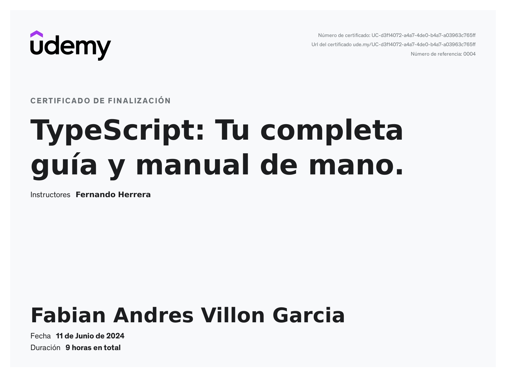

# Curso Typescript

Curso de fernando herrera  en Udemy para [Typescript](https://www.udemy.com/course/typescript-guia-completa/)

## Temas

* Tipos basicos
* Objetos Funciones
* Namespaces
* Decoradores
* Interfaces
* etc ...
* express con ts

# Certificado

